<h1>ClubHub by the Django Dynamos</h1>

<strong>Table of Contents</strong>
<ol>
<li>Introduction</li>
<li>Features</li>
<li>Wireframes</li>
<li>Responsiveness</li>
<li>Browser Compatibility</li>
<li>Code Validation</li>
<li>Deployment</li>
<li>User Story Tests</li>
<li>Bugs Solved</li>
<li>Bugs Unresolved</li>
<li>Future Sprints</li>
<li>Credits/Sources</li>
</ol>

<h2>Introduction</h2>
ClubHub, designed by Django Dynamos, is a full-stack campus connect website that strives to provide high-quality information about campus events.  It encourages user registration and interaction by offering the opportunity to create, read, update, and delete comments on individual events. Options are also available to share the site through social media (Facebook, X, and Instagram).

<h2>Features</h2>

<h3>Header & Footer</h3>

The header consists of the ClubHub logo on the left and the account options on the right.  The footer includes links to social media (Facebook, X, and Instagram).

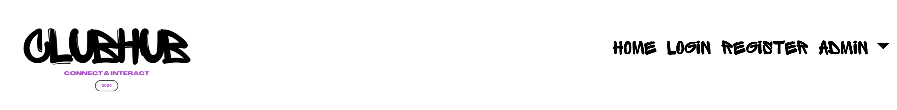

<h3>Account Registration</h3>

Users may register for an account, which requires a unique username of 150 characters or fewer and only letters, numbers, and select characters: _/+/-/./@. The password may not be too similar to the username, a commonly used password, or entirely numbers.  It must be at least 8 characters long. The password entry field is repeated for confirmation of accuracy.

<h3>Login</h3>

A dedicated login zone is linked to the ‘LOGIN’ tab at the upper left and allows the user to log into their account.

<h3>Logout</h3>

Logging out is completed by lowering the drop-down menu under ‘ACCOUNT’ in the upper right hand.  This allows the user to safely log out of the site.

<h3>Events Page</h3>

The main page of this exciting campus connect-style site, the Events Page displays truncated versions of the full descriptions.  Events are labelled according to category: fitness, mental health & wellbeing, donating, historic, clubs, entertainment, travel, and geography.

<h3>Event Details</h3>

Clicking on any one of the events will take the user to the individual event’s details. The events are described in full here, according to information supplied by the clubs and/or organising bodies.

<h3>Create Comments</h3>

A user may create a comment on an event when viewing the individual event details. 

<h2>Wireframes</h2>

Wireframes were created using Balsamiq. The original plans were:

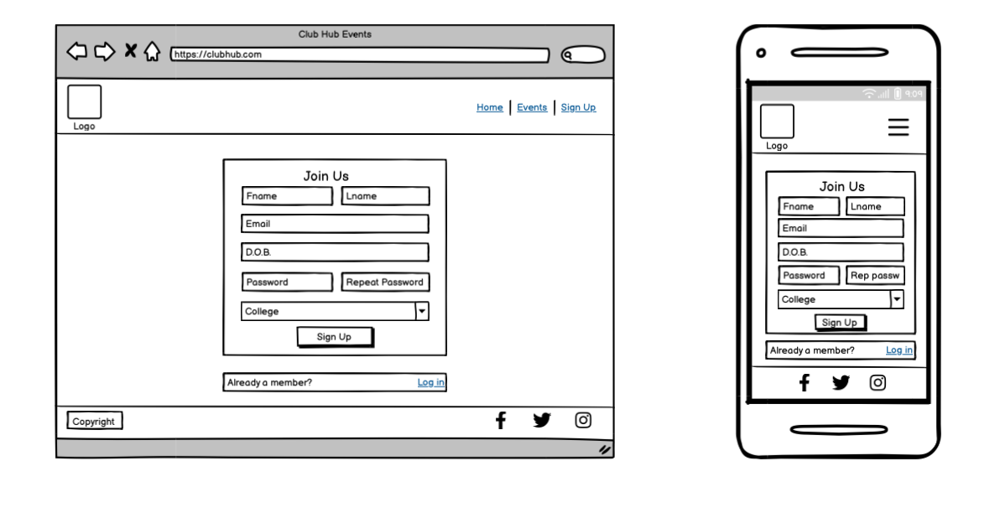

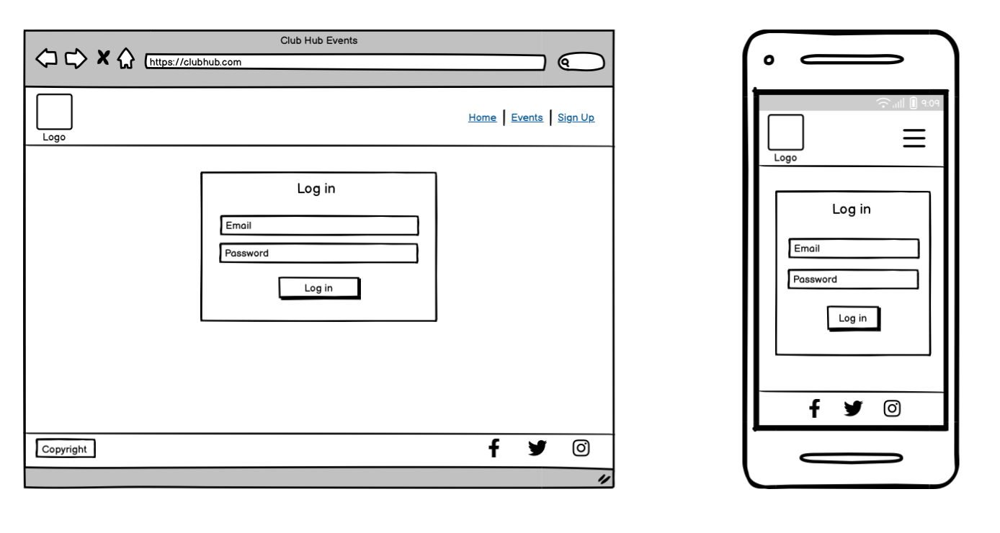

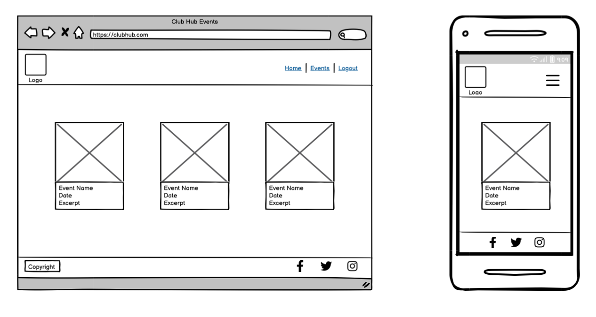

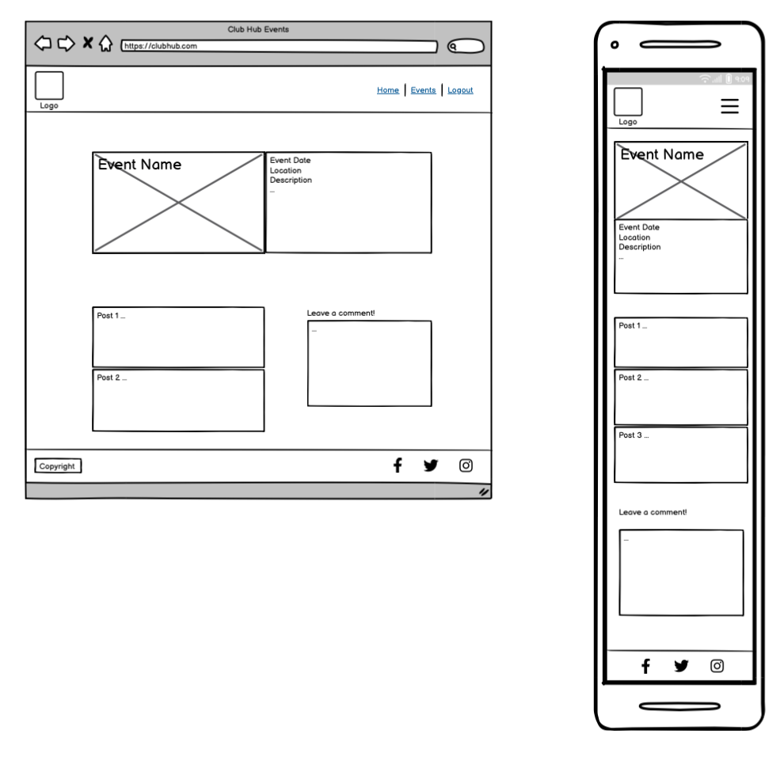

<h2>Responsiveness</h2>

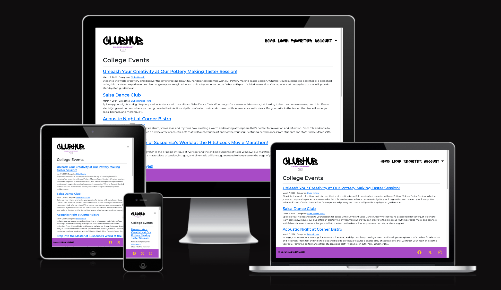

<table>
<tr>
    <th>Responsivity</th>
    <th>Smartphone</th>
    <th>Tablet</th>
    <th>PC</th>
    <th>Notes</th>
</tr>
   <tr>
    <td>Site is responsive >=700px</td>
    <td>n/a</td>
    <td>n/a</td>
    <td>Yes</td>
    <td></td>
  </tr>
<tr>
    <td>Site is responsive < 699px</td>
    <td>Yes</td>
    <td>Yes</td>
    <td>n/a</td>
    <td></td>
</tr>
<tr>
    <td></td>
    <td></td>
    <td></td>
    <td></td>
    <td></td>
</tr>
<tr>
    <td>Links/URLs work</td>
    <td>Yes</td>
    <td>Yes</td>
    <td>Yes</td>
    <td></td>
</tr>
<tr>
    <td>Images work</td>
    <td></td>
    <td></td>
    <td></td>
    <td>Next sprint</td>
</tr>
<tr>
    <td>Renders as expected</td>
    <td>Yes</td>
    <td>Yes</td>
    <td>Yes</td>
    <td></td>
</tr>
<tr>
    <td>Comments created as expected</td>
    <td>Yes</td>
    <td>Yes</td>
    <td>Yes</td>
    <td></td>
</tr>
<tr>
    <td>Notifications on successful login</td>
    <td></td>
    <td></td>
    <td></td>
    <td>Next sprint</td>
</tr>
<tr>
    <td>Notifications on successful creation</td>
    <td></td>
    <td></td>
    <td></td>
    <td>Next sprint</td>
</tr>
<tr>
    <td>Comments edited as expected</td>
    <td></td>
    <td></td>
    <td></td>
    <td>Next sprint</td>
</tr>
<tr>
    <td>Comments deleted as expected</td>
    <td></td>
    <td></td>
    <td></td>
    <td>Next sprint</td>
</tr>
<tr>
    <td>Notifications on successful logout</td>
    <td></td>
    <td></td>
    <td></td>
    <td>Next sprint</td>
</tr>

</table>

<h2>Browser Compatibility</h2>

<table>
<tr>
    <th></th>
    <th>Edge</th>
    <th>Chrome</th>
    <th>Firefox</th>
    <th>Notes</th>
</tr>
   <tr>
    <td>Intended appearance?</td>
    <td>Yes</td>
    <td>Yes</td>
    <td>Yes</td>
    <td></td>
  </tr>
<tr>
    <td>Intended responsiveness?</td>
    <td>Yes</td>
    <td>Yes</td>
    <td>Yes</td>
    <td></td>
</tr>
</table>

<h2>Code Validation</h2>

HTML code was validated using https://validator.w3.org/

CSS code was validated using https://jigsaw.w3.org/css-validator/ 

Errors related to Django were ignored.

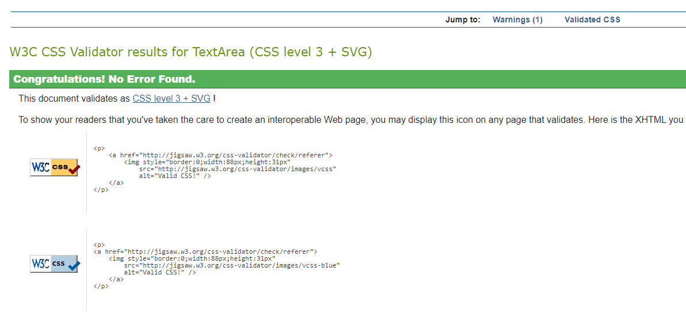

<h2>Deployment</h2>

ClubHub was successfully deployed at the end of each day, starting on Tuesday, March 5th at https://clubhub-hackathon-b9a3eaef9007.herokuapp.com. It was re-deployed at the end of every day of the Hackathon.

<h2>User Story Tests</h2>
<table>
    <tr>
        <th></th>
        <th>User Story</th>
        <th>MOSCOW</th>
        <th>Status</th>
    </tr>
    <tr>
        <td>1</td>
        <td>Open a post: As a Site User, I can click on a post/event so that I can read the full text. </td>
        <td>Must have</td>
        <td>Pass</td>
    </tr>
        <tr>
        <td>2</td>
        <td>View comments: As a Site User / Admin I can view comments on an individual post/event so that I can read the conversation. </td>
        <td>Must have</td>
        <td>Pass</td>
    </tr>
        <tr>
        <td>3</td>
        <td>Account registration: As a Site User I can register an account so that I can comment on a post/event.</td>
        <td>Must have</td>
        <td>Pass</td>
    </tr>
        <tr>
        <td>4</td>
        <td>Comment on a post: As a Site User I can leave comments on a post/event so that I can be involved in the conversation. </td>
        <td>Must have</td>
        <td>Pass</td>
    </tr>
        <tr>
        <td>5</td>
        <td>Manage posts: As a Site Admin I can create, read, update and delete posts so that I can manage my site content.</td>
        <td>Must have</td>
        <td>Pass</td>
    </tr>
        <tr>
        <td>6</td>
        <td>Modify or delete comment on a post: As a Site User I can modify or delete my comment on a post/event that I can be involved in the conversation. </td>
        <td>Should have</td>
        <td>Next sprint</td>
    </tr>
        <tr>
        <td>7</td>
        <td>Approve comments: As a Site Admin I can approve or disapprove comments so that I can filter out objectionable comments. </td>
        <td>Should have</td>
        <td>Next sprint</td>
    </tr>
        <tr>
        <td>8</td>
        <td>View paginated list of posts: As a site user, I can view a paginated list of posts so that I can select which post I want to view. </td>
        <td>Should have</td>
        <td>Next sprint</td>
    </tr>
        <tr>
        <td>9</td>
        <td>Create drafts: As a Site Admin I can create draft posts so that I can finish writing the content later.</td>
        <td>Could have</td>
        <td>Next sprint</td>
    </tr>
        <tr>
        <td>10</td>
        <td>Search function: As a user, I want to search for courses and interests so I can find my hobbies easily. </td>
        <td>Won't have</td>
        <td>Next sprint?</td>
    </tr>
</table>

<h2>Bugs Solved</h2>

<table>
    <tr>
        <th>Bug/Issue</th>
        <th>Image</th>
        <th>Resolution</th>
    </tr>
    <tr>
        <td>Unregistered users can comment</td>
        <td>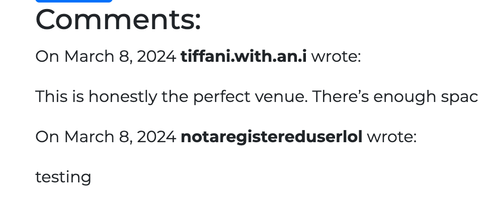</td>
        <td>Code added so that only registered users may view event details.
        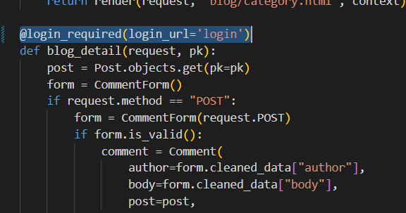</td>
    </tr>
    <tr>
        <td>Couldn’t check responsiveness from Heroku</td>
        <td></td>
        <td>Used gitpod.io with an unlocked port
        
    </tr>
</table>

<h2>Bugs Unresolved</h2>

<table>
    <tr>
        <th>Bug/Issue</th>
        <th>Image</th>
        <th>Information</th>
    </tr>
    <tr>
        <td>Categories page empty/not linked</td>
        <td>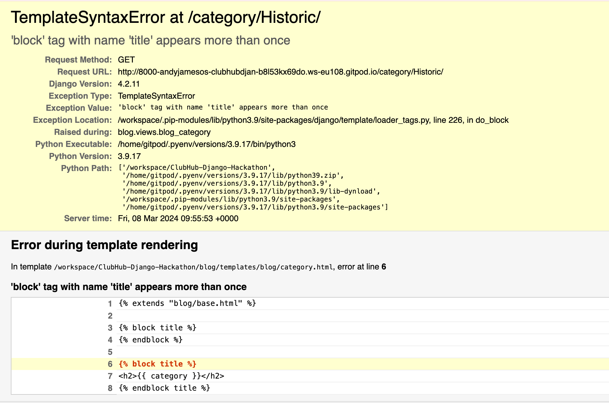</td>
        <td>Next sprint</td>
    </tr>
    <tr>
        <td>In tablet & phone mode, the drop-down menu is on the left.</td>
        <td>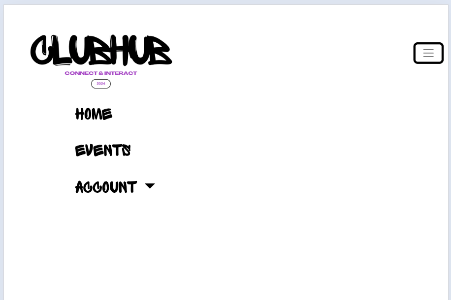</td>
        <td>Next sprint</td>
    </tr>
</table>

<h2>Future Sprints</h2>

Future sprints may include:
<ul>
<li>Modify or delete comment on a post</li>
<li>Approve comments</li>
<li>View paginated list of posts</li>
<li>Create drafts</li>
<li>Images</li>
<li>Search function</li>
<li>Summernote implementation for WYSISYG text</li>
</ul>

<h2>Credits/Sources</h2>

Font chosen from Google Fonts: Montserrat https://fonts.google.com/specimen/Montserrat 
Font for menu items: Sprite Graffiti

Favicon from Font Awesome: https://fontawesome.com/icons/globe?f=classic&s=solid

Club descriptions made using ChatGPT 3.5: https://chat.openai.com/ 

Logo created with Canva: https://www.canva.com/ 
	
Images compressed with https://tiny-img.com/image-compressor/

Colour Scheme, ‘Youthful and Fun’, from https://visme.co/blog/website-color-schemes/ 

Django walkthrough - https://realpython.com/build-a-blog-from-scratch-django/ 
